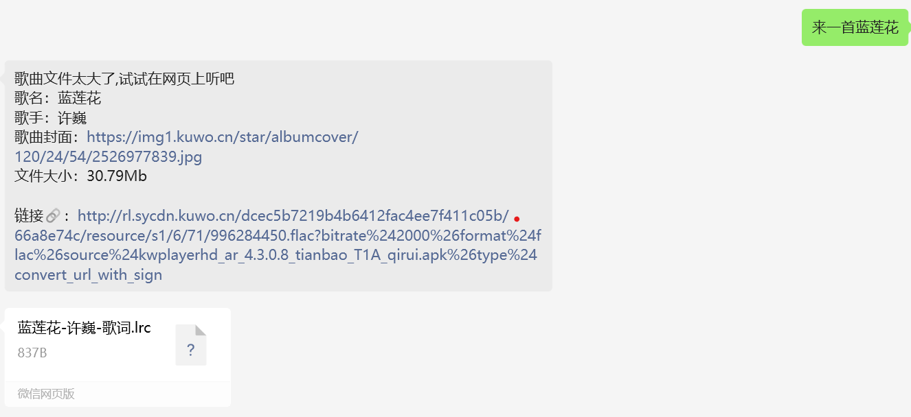

# weChatAssistant

一个微信聊天机器人，扫码登录后即可开始聊天

## 介绍

这个项目是一个微信聊天机器人，使用 Go 编写，使用微信网页版 API 实现，通过一次扫码登录后实现聊天功能。

## 功能

- 聊天：基于[openwechat](https://github.com/eatmoreapple/openwechat)项目实现，支持聊天、发送文件、图片等功能，作者还内置了微信所有的表情和丰富的消息类型处理函数，具体可查看[在线文档](https://openwechat.readthedocs.io/zh/latest/)。
- AI：接入[ChatAnyWhere](https://github.com/chatanywhere/GPT_API_free?tab=readme-ov-file),需要自行获取并配置 key，每日可以调用 200 此`gpt-4o-mini`。([配置 key](./api/gpt/chatbot.go#L179))
- 天气：接入[腾讯天气](https://github.com/bestyize/MiniWeather),具体参数自行查看这个[API 文档](https://github.com/bestyize/MiniWeather/blob/master/%E8%85%BE%E8%AE%AF%E5%A4%A9%E6%B0%94API.md)，效果如下
- 音乐：接入[酷我音乐 API](./api/musicapi.go)，搜索 api 已经写好了，有兴趣的可以自己改改。效果如下

> 如果文件小于 25M 会直接发送文件，大于 25M 则发送链接，因为网页版微信对文件大小有限制。

## 使用

```sh
git clone https://github.com/xiuyusheng/weChatAssistant.git
```

### windows

打开 cmd，执行`build`命令，再执行`main.exe`即可。

```cmd
go build main.go && main.exe
```

或者测试直接`run`

```cmd
go run main.go
```

### linux

在 windows 上打包 linux 可执行文件，然后执行即可。

```sh
set CGO_ENABLED=0
set GOOS=linux
set GOARCH=amd64
go build -o main-linux main.go
```

再将`main-linux`文件[storage.json](./storage.json)放到 linux 服务器上，并在当前目录下执行`chmod`来赋予权限。

```sh
chmod a+x main-linux
```

运行即可。

## 功能配置

这里的功能都是给 gpt 预设引导命令的，让他解析用户的消息，然后返回命令串，程序识别到后回调配置的函数实现功能添加。

- AI 语义功能：在[这里](./logic/gpt.go#L22)添加对应的引导语言和接收词加上回调函数即可，已给出了音乐和天气的引导示例自己多实验几次。

- 关键词触发功能：主要防止有限资源的浪费，一些不必要随意触发的功能可以通过关键词来触发，在[这里](./logic/shares.go#111)添加对应的关键词和回调函数即可，已给出了音乐和天气的触发示例自己多实验几次。

  > 注意：关键词触发功能和 AI 语义功能是互斥的，如果触发关键词，则不会执行 AI 语义功能。

- 聊天功能：在[这里](./logic/shares.go#27)添加，[openwechat](https://github.com/eatmoreapple/openwechat)的[在线文档](https://openwechat.readthedocs.io/zh/latest/)中可以找到聊天相关的函数，该项目中已经添加了拍一拍，收红包提醒，防撤回以及群改名回复等基础玩法，可以根据自己的需求添加删除。

> 以上优先级为聊天函数 > 关键词触发函数 > AI 语义函数。
